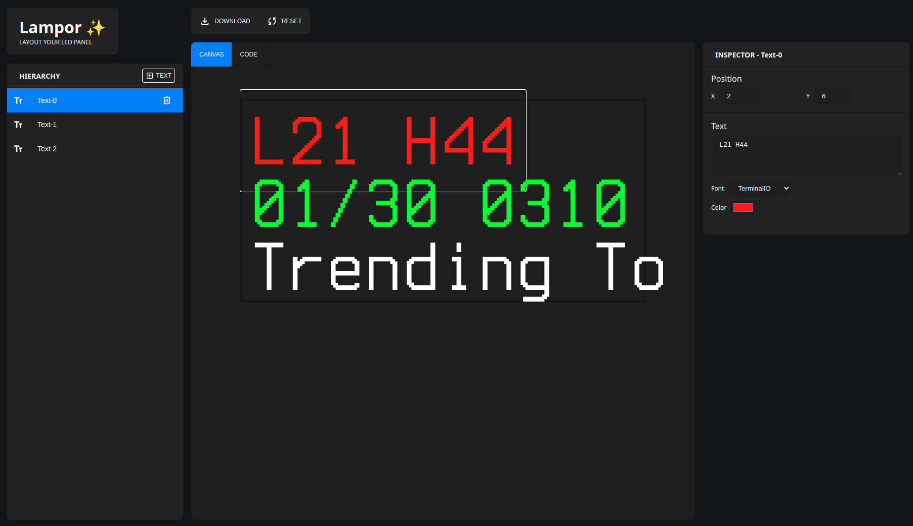
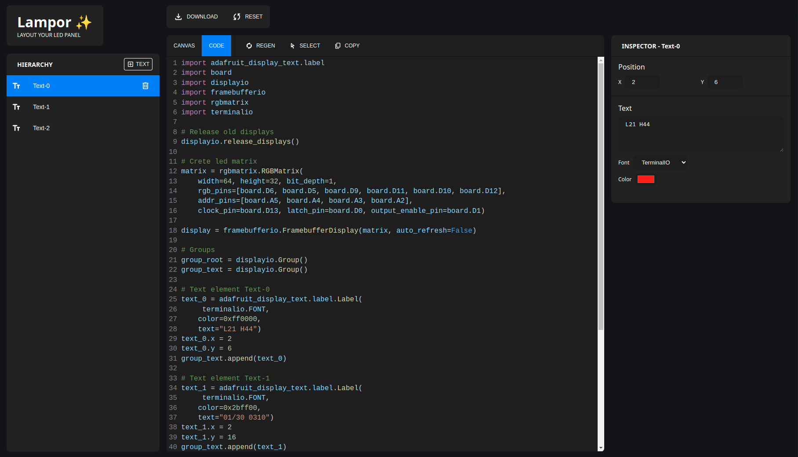
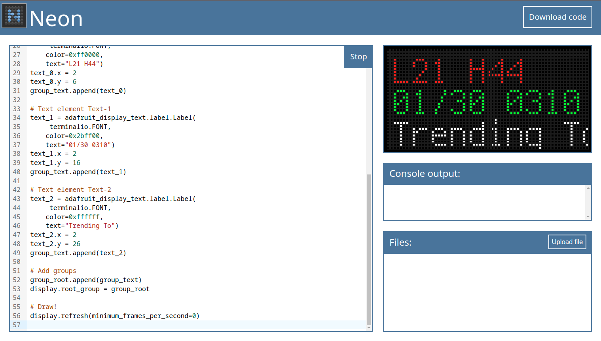

# Lampor

Easily layout your next LED matrix project using Lampor!

Add, move and style text elements and export simple boilerplate code to bring to live: [Guide](#guide)

## Guide

1. Go to [https://lampor.playlogo.hackclub.app/](https://lampor.playlogo.hackclub.app/) (or [host it yourself!](#hosting))
2. Add new text elements using the `+ Text` Button in the Hierarchy
3. Position them by dragging them around
4. Set their content and color using the Inspector

5. When you've finished your design, switch to the `Code` Tab
6. Hit `Copy` to put the boilerplate code into your clipboard
7. Go to [https://neon.hackclub.dev/editor](https://neon.hackclub.dev/editor) and hit `CTRL+V`
8. Done! Now add some life to your layout!

## Hosting

The project is written in Svelte using the Bun Javascript runtime.

1. Clone the repo: `git clone https://github.com/playlogo/lampor.git`
2. Go to the svelte folder: `cd lampor`
3. Install dependencies: `bun install` (`npm install` should also work, but not tested)
4. Start dev-server: `bun run dev`
